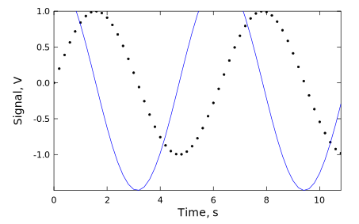

<!--
This README describes the package. If you publish this package to pub.dev,
this README's contents appear on the landing page for your package.

For information about how to write a good package README, see the guide for
[writing package pages](https://dart.dev/guides/libraries/writing-package-pages).

For general information about developing packages, see the Dart guide for
[creating packages](https://dart.dev/guides/libraries/create-library-packages)
and the Flutter guide for
[developing packages and plugins](https://flutter.dev/developing-packages).
-->
# dart-svgplot
A library for creating simple plots in Dart and exporting them as SVG. One may need this if they want to generate a PDF report with plots in Dart.

## Features

Can generate simple 2D line and scatter plots. Styles are customized using CSS directly.

## Getting started

TODO: List prerequisites and provide or point to information on how to
start using the package.

## Usage




```dart
  List<double> x = List.generate(55, (i) => i / 5);
  final plot = SvgGraphFigure(
    absoluteGeometry: Rect.fromLTWH(0, 0, 453.5, 283.5),
    lengthUnit: SvgGraphUnit.point
  );
  final ax = plot.axis(
    labelTextStyle: {
      'font-size': '14'
    },
    tickLabelTextStyle: {
      'font-size': '11'
    },
    xlabel: 'Time, s',
    ylabel: 'Signal, V',
  );
  ax.plot(
    x.map((x) => Point(x, sin(x))).toList(),
    marker: SvgGraphMarker.circle,
    lineStyle: {
      'stroke': 'none'
    }
  );
  ax.plot(
    x.map((x) => Point(x, 1.5 * cos(x))).toList(),
    lineStyle: {
      'stroke': '#0000ff',
    },
  );
  final document = plot.toSvgXml();
  (await File('example.svg')).writeAsString(document.toXmlString());
```

## Additional information

<!--
TODO: Tell users more about the package: where to find more information, how to
contribute to the package, how to file issues, what response they can expect
from the package authors, and more.
-->